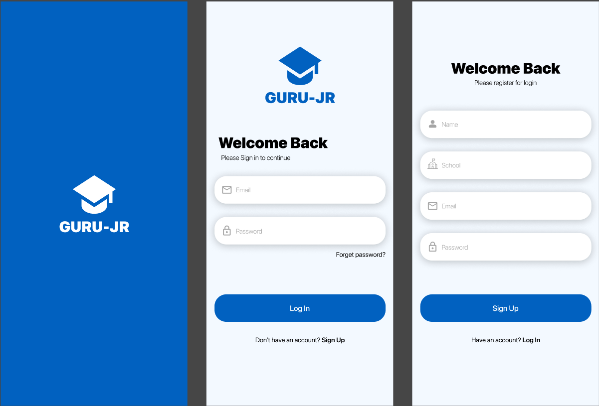

# Aplikasi Guru-JR

Aplikasi Guru-JR adalah sebuah platform Web mobile yang dirancang khusus untuk para guru yang berpartisipasi dalam program edukasi bersama Jasa Raharja. Aplikasi ini bertujuan untuk mempermudah proses pelaporan kegiatan, menyediakan materi edukasi yang relevan, serta meningkatkan keterlibatan guru melalui sistem gamifikasi (poin dan leaderboard).

---

## ✨ Fitur Utama

Berikut adalah fitur-fitur utama yang tersedia di dalam aplikasi Guru-JR:

### 1. 🔑 Autentikasi & Akun Pengguna

Sistem autentikasi yang aman untuk memastikan data pengguna terlindungi.

- **Registrasi Akun Baru:** Pengguna dapat mendaftar dengan menginput nama, nomor HP/email, asal sekolah, dan password.
- **Login:** Masuk ke aplikasi menggunakan nomor HP/email dan password yang terdaftar.
- **Reset Password:** Fitur untuk mengatur ulang password jika pengguna lupa.
- **Edit Profil:** Pengguna dapat memperbarui informasi pribadi mereka.

### 2. 📝 Pelaporan Kegiatan

Memudahkan guru untuk melaporkan setiap kegiatan edukasi yang telah dilaksanakan.

- **Form Laporan:** Input data kegiatan dengan field tanggal, keterangan, dan unggah dokumentasi (foto/video).
- **Poin Laporan:** Setiap laporan kegiatan yang berhasil dikirimkan akan memberikan **50 poin**.
- **Riwayat Laporan:** Semua laporan yang pernah dibuat akan tersimpan dan dapat diakses kembali.

### 3. 📊 Monitoring & Dashboard

Guru dan admin Jasa Raharja dapat memantau progres dan aktivitas secara real-time.

- **Dashboard Individu:** Menampilkan total laporan yang telah di-submit dan jumlah poin yang dimiliki oleh masing-masing guru.
- **Leaderboard:** Menampilkan peringkat **Top 3 Guru** dengan perolehan poin tertinggi untuk memotivasi partisipasi.

### 4. 📚 Materi Edukasi & Library

Pusat sumber belajar digital bagi para guru.

- **Video Edukasi:** Kumpulan video atau animasi materi yang selalu diperbarui.
- **Poin Edukasi:** Setiap selesai menonton materi, guru akan mendapatkan **25 poin**.

---

## 🚀 Cara Menjalankan Proyek (Contoh)

Berikut adalah langkah-langkah untuk menginstal dan menjalankan proyek ini di lingkungan pengembangan lokal.

### Prasyarat

Pastikan sudah menginstal perangkat lunak berikut:

- Node.js (v18 atau lebih baru)
- Yarn atau NPM

### Instalasi

1.  **Clone repository ini:**

    ```bash
    git clone [https://github.com/username/JasaRaharja-MobileApp.git](https://github.com/username/JasaRaharja-MobileApp.git)
    ```

2.  **Masuk ke direktori proyek:**

    ```bash
    cd JasaRaharja-MobileApp
    ```

3.  **Install semua dependency yang dibutuhkan:**

    ```bash
    npm install
    # atau jika menggunakan yarn
    yarn install
    ```

4.  **Menjalankan Web**

    - **NPM:**
      ```bash
      npm run dev
      ```
    - **Yarn:**
      ```bash
      yarn run dev
      ```
